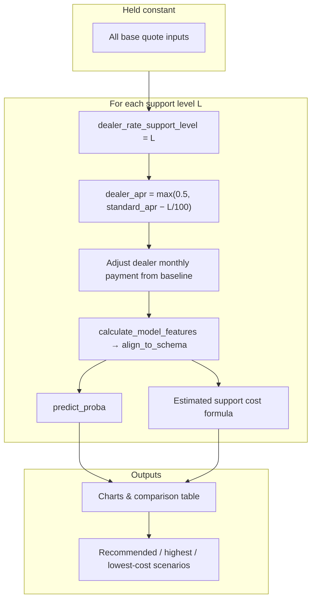

# Auto Finance Subvention Optimization Simulator — Architecture

This document describes how the Streamlit application collects inputs, builds model-ready features, runs predictions, and executes the dealer support scenario sweep.

## Overview

The app is a **conversion simulator**: users enter a structured automotive finance quote (customer, vehicle, dealer/inventory, financing, competitor, market). After **Run analysis**, the pipeline aligns inputs to the trained model schema, predicts **conversion probability** for the baseline offer, then **sweeps** discrete dealer rate-support levels to compare predicted conversion and estimated support cost.

**Primary artifacts**

| File | Role |
|------|------|
| `model_pipeline.pkl` | Serialized sklearn / LightGBM classifier pipeline (`joblib.load`). |
| `feature_schema.json` | Canonical `required_columns` for alignment before `predict_proba`. |
| `sample_input.json` | Optional defaults for alignment gaps during development. |
| `model_metadata.json` | Training metadata (not used at inference beyond documentation). |

Core logic lives in **`app.py`**.

---

## End-to-end flow

```mermaid
flowchart LR
  subgraph inputs["Business inputs (sidebar)"]
    S1[Customer]
    S2[Vehicle]
    S3[Dealer / inventory]
    S4[Financing / offer]
    S5[Competitor]
    S6[Market / timing]
  end

  subgraph gate["Gate"]
    BTN[Run analysis]
  end

  subgraph prep["Feature prep"]
    BF[build_business_inputs]
    CF[calculate_model_features]
    AL[align_to_schema]
    SCH[(feature_schema.json)]
  end

  subgraph model["Model"]
    PKL[(model_pipeline.pkl)]
    PP[predict_proba → P(convert)]
  end

  subgraph sim["Simulation"]
    SW[support levels 0–300]
    ADJ[Adjust APR / payment per level]
    LOOP[Predict each scenario]
    ENR[Enrich metrics & recommend]
  end

  subgraph ui["UI"]
    T1[Scenario Inputs]
    T2[Recommended Strategy]
    T3[Scenario Comparison]
    T4[Model Details]
  end

  S1 & S2 & S3 & S4 & S5 & S6 --> BF
  BF --> BTN
  BTN --> CF
  CF --> AL
  SCH --> AL
  AL --> PKL
  PKL --> PP
  PP --> T1
  AL --> SW
  SW --> ADJ --> LOOP --> ENR
  LOOP --> PKL
  ENR --> T2 & T3
  PKL --> T4
```

---

## Inputs collected

Sidebar sections map into a single **`build_business_inputs()`** dict (session-backed widgets). Business-facing labels intentionally avoid internal ML naming on primary surfaces.

| Section | Examples |
|---------|----------|
| **1 · Customer** | Credit score, monthly income, DTI, 1–10 sliders (price sensitivity, urgency, brand, purchase intent, sentiment, etc.), customer segment, EV / family / truck / conquest sliders. |
| **2 · Vehicle** | Make, model, year, trim, body, fuel, vehicle type, price, age, residual strength, residual support %, residual-push flag. |
| **3 · Dealer & inventory** | Dealer size, metro flag, retail volume, margins, days in inventory, units on hand / in transit, aged-inventory share, stockout / overstock flags, inventory pressure. |
| **4 · Financing & offer** | Loan amount, down payment, term, **standard APR**, **dealer APR**, monthly payment, customer / dealer / loyalty / conquest cash, promotion flag, **dealer rate support level** (scenario baseline). |
| **5 · Competitor** | Primary competitor, competing APR / payment / cashback, aggressiveness & momentum sliders. |
| **6 · Market & timing** | Benchmark rates, Treasury, CPI, rate indices, quote month/weekday, quarter-end, sales type, region, state; **Advanced calibration**: support cost multiplier. |

Predictions and the scenario sweep run **only after** the user clicks **Run analysis** (`quote_submitted` in session state).

---

## Feature engineering

**`calculate_model_features(business)`** produces a row keyed like **`feature_schema.json → required_columns`**, including:

- **Bands / tiers**: `fico_band`, `credit_tier`, `income_band` from score and income rules.
- **Ratios**: `payment_to_income`, `ltv`, `down_payment_pct`.
- **Cash**: `total_cash_rebate` (customer + loyalty + conquest).
- **Competitive construct**: `apr_gap_bps`, `payment_gap`, `cashback_gap`, `competitor_pressure_score`, `offer_advantage_score`, and interaction-style terms used by the model.
- **APR columns expected by the pipeline**: `standard_apr`, `subvented_apr` (e.g. `max(0.5, standard_apr − support_level/100)`), alongside `dealer_apr` and `dealer_rate_support_level`.

**`align_to_schema(row, schema, sample_defaults)`** builds a single-row `DataFrame` with columns in **`required_columns`** order; missing keys may be filled from **`sample_input.json`** only when necessary.

---

## What is predicted

| Output | Meaning |
|--------|---------|
| **Baseline conversion probability** | `predict_proba` positive class for the **current** aligned row (user’s baseline support level and APR/payment). |
| **Per-scenario conversion probability** | Same model, one prediction per support level in the sweep. |

The **recommended efficient scenario** is **not** always maximum conversion; it follows rule-based filtering on lift, increments, and **efficiency score** (lift vs estimated support cost), with tie-break toward lower cost when scores are close.

---

## Scenario simulation

For each candidate **`dealer_rate_support_level`** in the configured grid (e.g. `0 … 300`):

1. **Hold fixed** all user inputs except the simulated financing knobs derived from the sweep.
2. Set **`dealer_apr`** ≈ `max(0.5, standard_apr − level/100)` (consistent with training-style subvention math).
3. Adjust **`dealer_monthly_payment`** from the baseline using the delta in support level (see `run_support_scenarios` in `app.py`).
4. Recompute derived fields via **`calculate_model_features`**, align, **`predict_proba`**.
5. **Estimated support cost** ≈ loan × (level / 10000) × **cost multiplier** + cash components (customer, loyalty, conquest, dealer cash).

**`enrich_offer_simulator_metrics`** adds lift vs no-support, incremental gains/costs, cost per conversion point, and efficiency score for tables and charts.



---

## UI surface

| Tab | Purpose |
|-----|---------|
| **Scenario Inputs** | Baseline prediction and business-readable competitive summary after submit. |
| **Recommended Offer Strategy** | Efficient, highest-conversion, and current-input scenario cards. |
| **Scenario Comparison** | Charts and sortable table over the sweep. |
| **Model Details** | Collapsed technical views: metadata, schema, aligned row, scenario-derived preview. |

Loaders are shown during **model load** and during **analysis** (prediction + sweep + enrichment) after submit.

---

## Dependencies

See **`requirements.txt`** (Streamlit, pandas, numpy, scikit-learn, LightGBM, joblib, Altair). The pinned sklearn range should stay compatible with the environment used to pickle **`model_pipeline.pkl`**.
